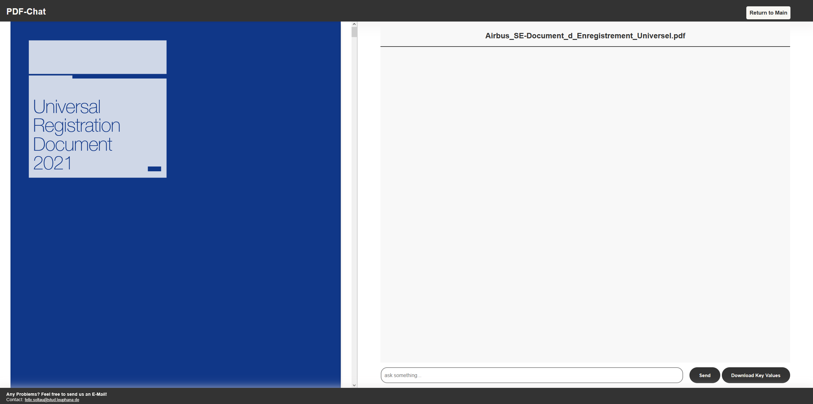

# Ai-Application by Team Rocket - LLM PDF Chat Interface
developed by Bent Mildner, Marcel Seibt and Felix Soltau

## 📝 Description

This project enables communication with a large language model (LLM) to ask questions about PDF files — specifically Environmental Sustainability Reports from various companies.

We provide a **web-based user interface** where users can:

- Upload a PDF file.
- Wait for it to be processed.
- Interact with a chat interface to ask questions about the file.

### Key Features

- 🗂 PDF viewer on the left side to browse the uploaded document.
- 💬 Chat window that always displays the PDF title.
- 📥 "Download Key Values" button to export extracted values as a JSON file.
- 🔄 "Return to Main" button to reset the process and upload a new file.

The **frontend** is a React app and communicates with a **Flask backend** written in Python.

## 🖼 Visuals

## ⚙️ Installation

### 1. Clone the Repository

git clone https://github.com/felix-sol/Ai-Application

### 2. .env file
Create a .env file in the root directory like the .env.example file (next to docker-compose.yml) and include your API key:

### 3. Docker Deployment
Use Docker to deploy the project:
docker compose -f "docker-compose.yml" up -d --build
This works the same on Windows and macOS (Tested with Docker Desktop using the "Run All Services" button).

## 🛠 Troubleshooting (Manual Installation)
If Docker doesn't work as expected, you can manually install dependencies.

Backend (Python):

pip install flask
pip install python-dotenv
pip install flask-cors
pip install chromadb
pip install langchain-community
pip install requests
pip install openai
pip install PyPDF2
pip install langchain

Frontend (React)
Make sure Node.js (v22.16.0) and npm (v10.9.2) are installed.
npm install @react-pdf-viewer/core
npm install @react-pdf-viewer/default-layout
npm install react-router-dom
npm install @testing-library/dom

## Usage
Once running, the app allows users to:

Upload a sustainability report in PDF format.

Ask questions and receive contextual answers from the LLM.

Download extracted key values in JSON format.

⚠️ Disclaimer: Since LLMs can hallucinate or generate inaccurate answers, always verify critical information directly from the PDF file.

## Support
For questions or issues, please contact us via email:
Bent.Mildner@stud.leuphana.de
Marcel.Seibt@stud.leuphana.de
Felix.Soltau@stud.leuphana.de

